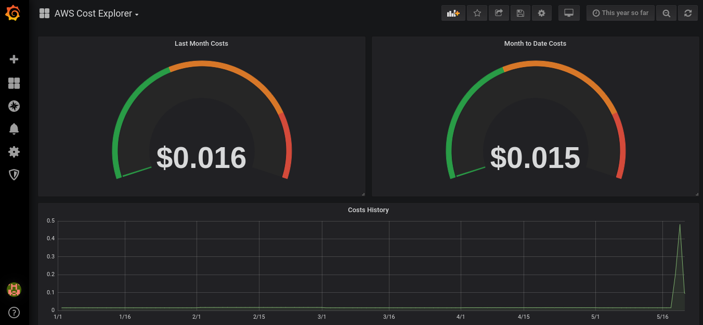
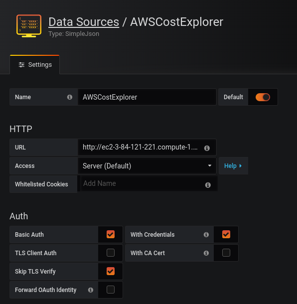
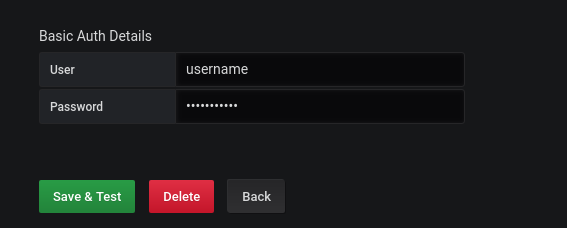
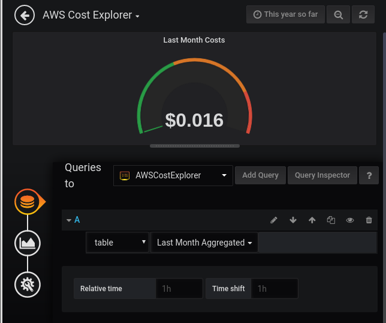
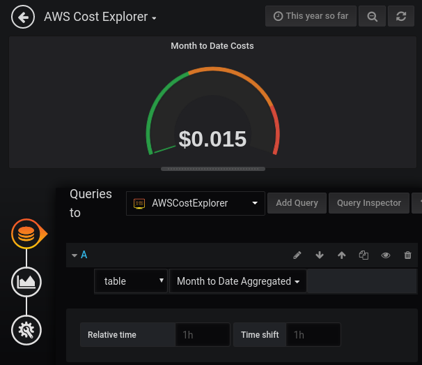
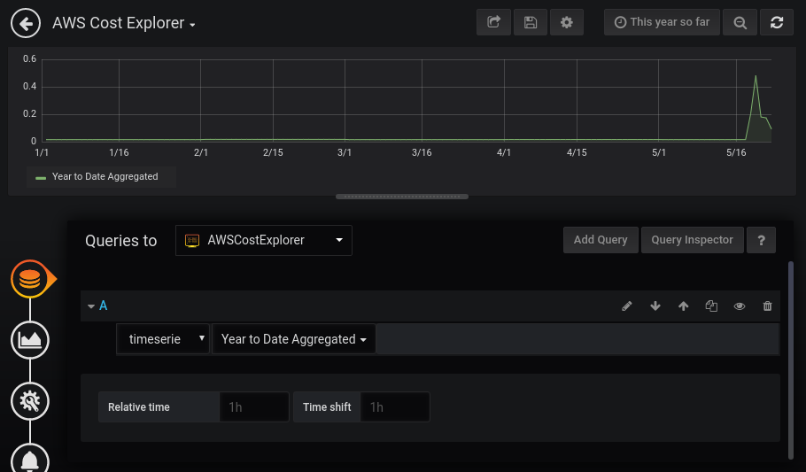

# grafana-aws-cost-explorer-backend
Grafana Backend for AWS Cost Explorer using [AWS Cost Explorer Library](https://github.com/dnavarrom/aws-cost-explorer)



Features: 

* Cost Explorer API Query Cache to reduce costs
* YTD (Year to Date costs)
* MTD (Month to Date costs)
* Last Month costs
* Today Costs

## Backend Configuration

### Config File

Details for AWS configuration [here](https://github.com/dnavarrom/aws-cost-explorer)

```
Git clone https://github.com/dnavarrom/grafana-aws-cost-explorer-backend

cd grafana-aws-cost-explorer-backend

nano ./config/default.js

# Edit the following AWS variables

accessKeyId: <Your AWS Key>
secretAccessKey: <Your AWS Secret Key>

# Edit backend Security Settings

enabled : "false" <default false (disabled)>
secret : "thepassword"

# Optional cache settings

ttl : seconds to refresh cache (call aws api)
checkperiod : the same
deleteOnExpire : to delete cache when refresh

#run server

node index.js

```

Test locally

```
curl localhost:8090
It works!!
```


## Grafana Datasource Configuration

* Install [Simple Json Datasource Plugin](https://grafana.com/plugins/grafana-simple-json-datasource/installation)
* Configure New Datasource using Server Access (if you want to use browser based access, change AUTH.enabled = false in the backend config file)





## Grafana Dashboard Configuration

Sample Dashboard can be downloaded [here](https://github.com/dnavarrom/grafana-aws-cost-explorer-backend/docs/sampleDashboard.json)

* Last Month Costs Widget uses Last Month Aggregated Query - Table Type


* Month to Date uses Month to date Aggregated Query - Table type


* Year to date uses Timeseries



## Todo:

* Enable Tag Filtering (¿using variables?)
* Implement annotations
* Create docker image
* Create AWS Cloud Formation script

